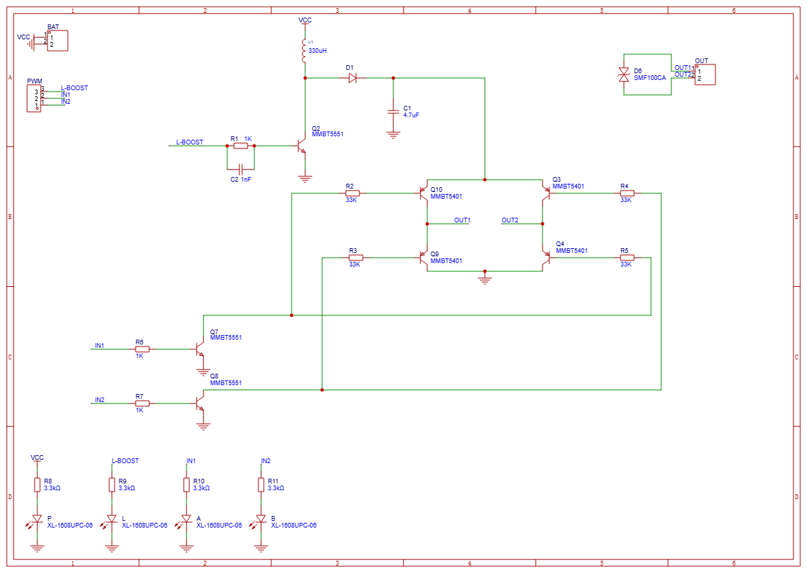
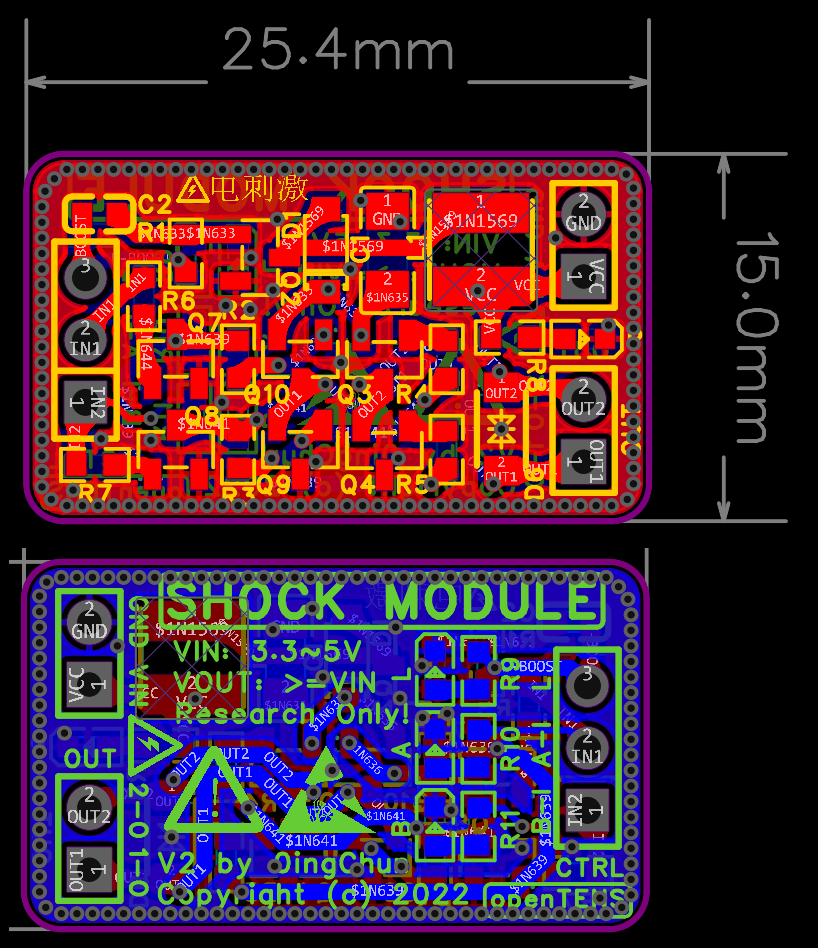

<p align="right">
  <a href="README_CN.md">
    
  </a>
</p>

# openTENS: Open-Source Electrical Stimulation System

<p align="center">
  
</p>
<p align="center">
  A **programmable, safe, and flexible** electrical stimulation platform  
  designed for research and wearable applications.
</p>

---

## 👋 Welcome to openTENS!

Thank you for visiting!  
**openTENS** is an open-source electrical stimulation platform designed for **researchers, designers, and developers**.

This README provides the core information of the project. You may jump directly to the sections below:

---

## 🚩 Problems We Are Solving

### 🔍 Background & Challenges

* Most commercial **TENS/EMS devices** are closed systems – users cannot modify waveforms or implement closed-loop control  
* Researchers who want to explore different stimulation modes must build circuits from scratch → high cost & safety risks  
* There is no standardized hardware interface for combining stimulation with **GSR, EMG, IMU**, or other sensors  
* In wearable applications, **textile electrodes vary in comfort and signal quality**, making evaluation difficult  

### 💡 openTENS — Our Solution

The goal of **openTENS** is to become the **“Arduino Platform”** of electrical stimulation:

* Provides **programmable bipolar output (H-Bridge)**
* Built-in **hardware current limiting & isolation** for safety
* Integrated **real-time GSR sensing** for closed-loop control
* Supports **conductive textile electrodes & multimodal sensors**
* Open-source — **firmware + PCB** are fully modifiable

With openTENS, you can rapidly prototype:

* Electrical stimulation + emotion regulation experiments  
* Rehabilitation systems using textile electrodes  
* Human-computer interaction & affective computing research  

---

## 🧠 Hardware Design

To help you understand the **hardware blocks and signal flow of openTENS**,  
below are the core circuit and module diagrams:

<p align="center">
  
</p>

<p align="center">
  <em>Figure: Core schematic of openTENS v2</em>
</p>

<p align="center">
  
</p>

<p align="center">
  <em>Figure: PCB design of openTENS v2</em>
</p>

Learn more 👉 [Hardware Module Guide](hardware_PCB/README.md)

---

## 📚 Software SDK

To learn how to use the SDK and built-in driver libraries, visit:  
👉 [SDK & Software Library Guide](software_SDK/README.md)

---

## 🚀 Installation & Quick Start <a name="installation"></a>

> (Hardware setup and SDK tutorials will be added later)

1. Clone the repository

```bash
git clone https://github.com/0ingchun/openTENS.git
cd openTENS
```

2. 👉 Read **Hardware Module Guide**: `hardware_PCB/README.md`  
3. 👉 Read **SDK & Software Library Guide**: `software_SDK/README.md`

---

## ⚠️ Safety Notice

Before assembling or using any openTENS hardware, please read:  
👉 [Safety & Disclaimer (SAFETY_NOTICE.md)](SAFETY_NOTICE.md)

---

## ⚠️ Disclaimer

- All web content (including any paid features) has no commercial affiliation with the developers.  
- All software icons and design elements belong to the project creators. Commercial use and public distribution are prohibited.  
- The software is for educational and experimental use only. Please comply with local regulations and delete any sensitive content within 24 hours.  
- By downloading or using this hardware/software, you agree to the above terms.  
- Please follow the open-source license of this project.

---

## 👨‍🔬 Who Developed openTENS?

openTENS was initiated by:  
**Y. Liu** & **X. Teng**, Xi’an Jiaotong-Liverpool University (XJTLU)  
Supervising Professor: **Prof. M. ten Bhömer**

This project is inspired by our research paper:  
[“H-Bridge Bipolar Stimulation System with Real-Time GSR Feedback”](https://ieeexplore.ieee.org/abstract/document/11120621)

Our goal is to transform research achievements into an open platform that enables safe exploration and validation of EMS technology.  
If this project contributes to your research, you are welcome to cite our paper.  
Paper: **https://ieeexplore.ieee.org/abstract/document/11120621**

---

### **Copyright Information**

Copyright (c) 2025 [0ingChun](https://github.com/0ingchun), All rights reserved.

---

## 📄 Open-Source License

Hardware schematics and PCB designs are released under the **Apache 2.0 License**.  
Firmware and software are released under the **Apache 2.0 License**.

---

## 🧭 Related Open-Source Project

[**dogoLab – Open-source remote EMS device with motion sensors**](https://github.com/0ingchun/dogoLab)  
powered by Arduino & ESP32

<p align="center">
  
</p>

---
