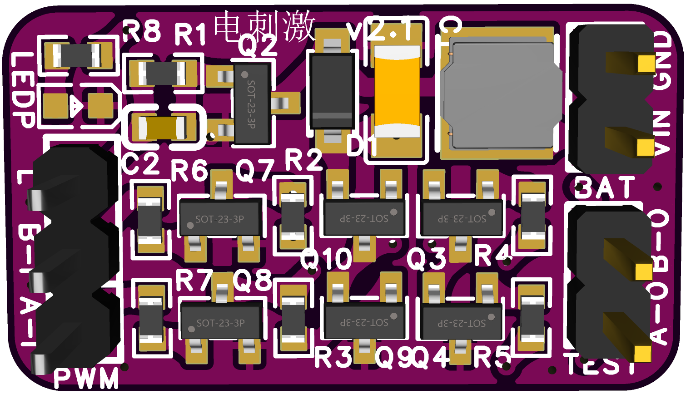
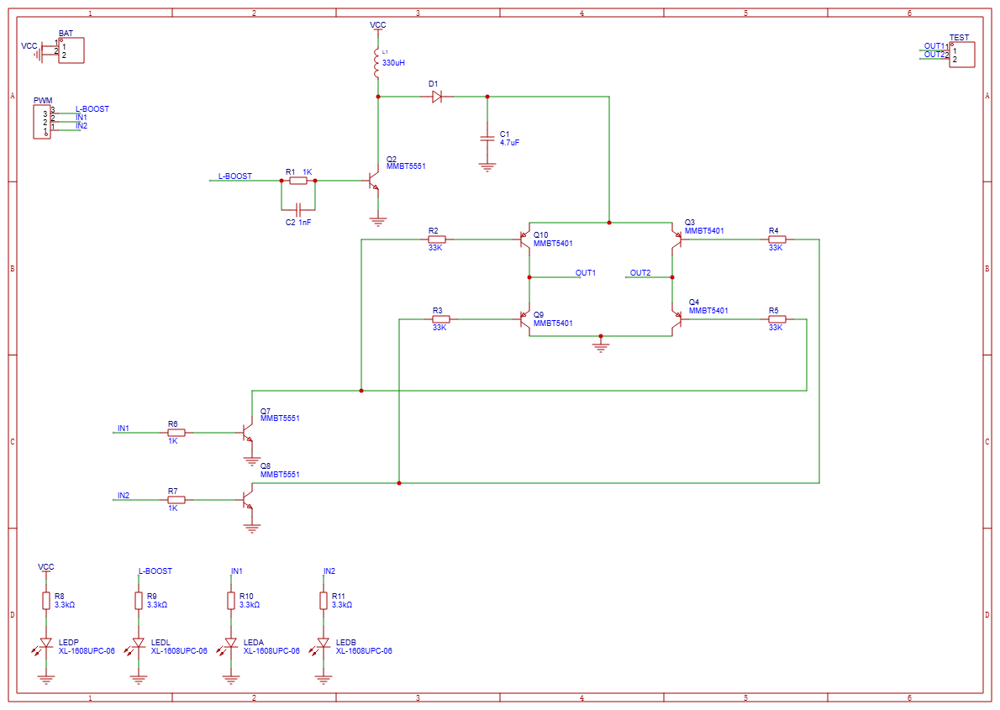

<p align="right">
  <a href="README_CN.md">
    
  </a>
</p>

#  openTENS: Open-Source Electrical Stimulation System

<p align="center">
  
</p>
<p align="center">
  A programmable, safe, and flexible electrical stimulation platform for research and wearable applications
</p>

---

##  Welcome to openTENS!

First of all, welcome! 
Thank you for your interest in **openTENS** — an open-source electrical stimulation platform designed for researchers, designers, and developers.

This README provides essential information about the project.  
You can jump directly to the following sections:

---

##  What Are We Doing?

### Background & Problem

- Most commercial **TENS/EMS devices** are closed systems — users cannot modify waveforms or implement closed-loop control  
- Researchers who want to explore **different stimulation patterns or modes** must build custom circuits, which increases cost and safety risks  
- There is a lack of **standardized hardware interfaces** for combining electrical stimulation with **GSR, EMG, IMU**, or other sensors  
- In wearable applications, the **signal quality and comfort of textile electrodes** remain inconsistent and difficult to evaluate  

###  Our Solution

**openTENS** aims to become an open-source, Arduino-like platform for customizable electrical stimulation:

- Provides **programmable bipolar electrical stimulation output (H-Bridge)**  
- Implements **hardware current limiting and isolation** for user safety  
- Integrates **real-time GSR sensing** for closed-loop control  
- Supports **conductive textile electrodes** and multimodal sensor extensions  
- Open-sourced **both firmware and PCB design**

With openTENS, you can quickly prototype:

- Electrical stimulation + emotion regulation experiments  
- Textile-electrode-based rehabilitation systems  
- Intelligent human-computer interaction and affective computing studies  

---
##  System Overview and Hardware Design

To help you better understand how **openTENS** works at the hardware level,  
the following schematics illustrate the **core circuit design** and **signal flow** of the system.

<p align="center">
  
</p>

<p align="center">
  
</p>

<p align="center">
  <em>Figure: Core electrical stimulation circuit and control module of openTENS.</em>
</p>

##  Safety Notice
Please read the [Safety Disclaimer](SAFETY_NOTICE.md) carefully before assembling or using any openTENS hardware.


##  SDK and Library Documentation

To learn how to use the SDK and built-in library functions, please visit:  
 [SDK & Library Guide](sdk/sdk.md)

##  Installation and Quick Start <a name="installation"></a>

> (This section can include hardware setup and SDK installation instructions later.)

1. Clone the repository  
   ```bash
   git clone https://github.com/yourusername/openTENS.git
   cd openTENS
   
   
