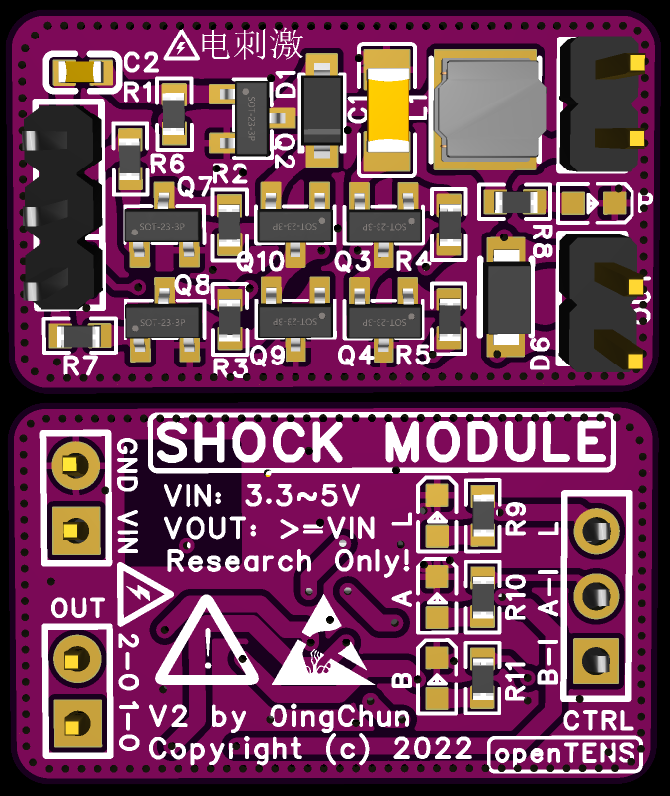
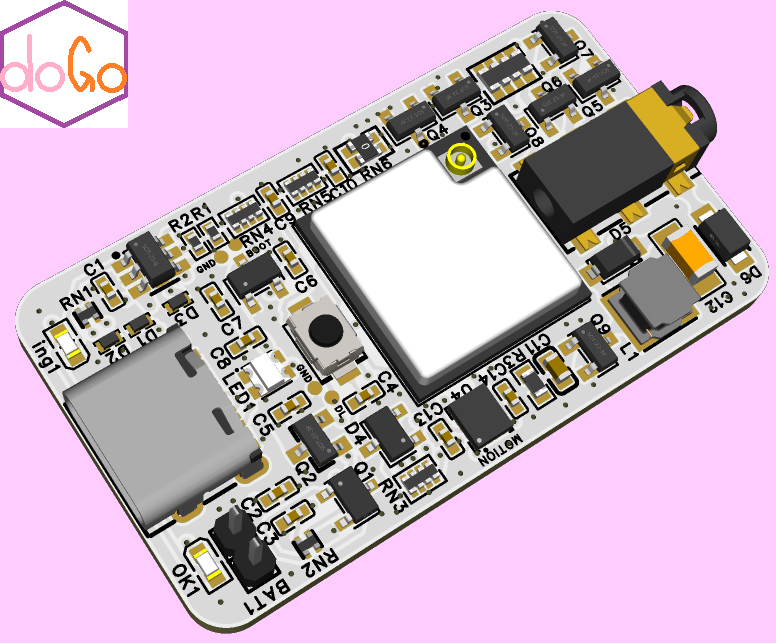

openTENS

## PCB & Schematic

We recommand **AC_TENS_version2** for a shock moudle and **adapterBoard_version1** to adapte your breadboard.

You can just donwload PCB Greber or check project files in easyEDA.

  

  <em>图：openTENS AC_TENS_version2</em>

  

  <em>图：openTENS adapterBoard_version1</em>

---

AD TIME~

## 🧭 相关开源项目

[**dogoLab - 开源的带体动传感器的遥控电刺激设备**](https://github.com/0ingchun/dogoLab)
powered by Arduino & ESP32

  

---