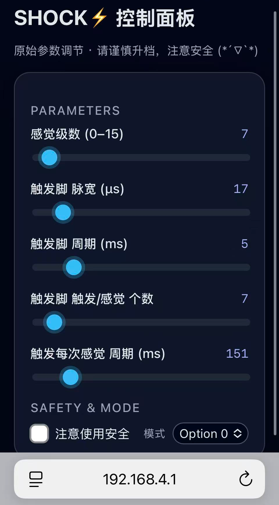

## 🚀 Quick Start（Dev Library for Arduino / ESP32 / Keilu5_c）

openTENS 提供 通用的电刺激开发库，可移植到任何 Arduino / ESP32 项目中，仅需 2 个文件（.c / .h） 即可实现电刺激功能。

---

### 📂 文件结构（你的项目中需要包含这两个文件）
```
/WIFIAP2SHOCK_ESP32-C3_PIO
 ├─ include/
 │   ├─ shockModule.h     ← ⭐ 主要头文件
 │   └─ main.h
 ├─ src/
 │   ├─ main.cpp
 │   └─ shockModule.c     ← ⭐ 实现文件
 ├─ platformio.ini
```


只需 shockModule.h + shockModule.c → 你的项目就能直接调用刺激模块。

---

### ⚡ 使用流程：4 步生成电刺激
Step	功能	所需代码
1	定义控制引脚	#define NET_P_Pin 10
2	初始化模块	shockAllInit(&shockPluse_s);
3	设置参数	shockPluseSenseSet(&shockPluse_s, slider_temp);
4	产生脉冲	shockPulseSenseUnit(&shockPluse_s);

#### 🧠 Step 1：定义刺激控制引脚

example：

```
#define NET_P_Pin      10	// 第一个交流脉冲控制脚
#define NET_N_Pin      6	// 第二个交流脉冲控制脚
#define BOOST_L_Pin    7	// 升压控制脚
#define LEDC_CHANNEL_NUM 0	// PWM产生通道控制脚（用于和升压控制脚内部绑定）
```


#### ⚙ Step 2：初始化模块
```
shockAllInit(&shockPluse_s);
```


#### 🧾 Step 3：设置刺激参数（可来自 Web UI）

Web UI 示例：
可直接通过滑块调整参数，手动测试好想要的脉冲参数后，即可写入结构体：

<p align="center">  </p>

对应代码设置（示例）：

```
shockPluseSenseSet(&shockPluse_s, slider_temp);
```


结构体内部设置（在 shockModule.c 中）：

```
void shockPluseSenseSet(shockPluse_t* shockPluse_s_p, int* p_temp){
    shockPluse_s_p->boost_Level = p_temp[0];  // 强度
    shockPluse_s_p->trig_Width = p_temp[1];   // 脉宽 us
    shockPluse_s_p->trig_T = p_temp[2];       // 脉冲周期 ms
    shockPluse_s_p->trig_Count = p_temp[3];   // 单次刺激个数
    shockPluse_s_p->usense_T = p_temp[4];     // 感觉周期
}
```


#### ⚡ Step 4：产生刺激脉冲
```
shockPulseSenseUnit(&shockPluse_s);
```


只需调用一次，即可输出一次完整刺激。（注意，次函数为**阻塞性延迟函数**）

---

### 🎯 使用逻辑图
**Set pins  →  Init module  →  Set parameters  →  Run shockPulseSenseUnit()**


---

##  Data Structure

### `shockPluse_t`

Defines all runtime parameters for one stimulation cycle.

| Field | Type | Description |
|-------|------|-------------|
| `htim_Boost_L` | `TIM_HandleTypeDef*` | Timer handle for PWM generation |
| `Channel_Boost_L` | `uint32_t` | PWM channel |
| `GPIOx_Net_P / GPIOx_Net_N` | `GPIO_TypeDef*` | H-Bridge output pins |
| `boost_T` | `uint32_t` | Boost pulse duration (μs) |
| `boost_F` | `uint32_t` | Boost frequency (Hz) |
| `boost_Width` | `float` | PWM duty ratio (%) |
| `boost_Level` | `uint8_t` | Intensity level (0–15) |
| `trig_Width` | `uint32_t` | Trigger pulse width (μs) |
| `trig_T` | `float` | Trigger period (ms) |
| `trig_Count` | `uint16_t` | Number of trigger pulses per stimulation |
| `usense_T` | `float` | Delay between stimulations (ms) |

---

##  Core Functions

###  Initialization and Configuration

#### `void shockIOPinConfig(shockPluse_t* s)`
> Configure the I/O pins and timer handles for stimulation output.

#### `void shockConstConfig(shockPluse_t* s)`
> Set default constant parameters (frequency, duty ratio, etc.).

#### `void shockAllInit(shockPluse_t* s)`
> Initialize all shock module components (timers, GPIO, constants).

---

###  PWM Control

#### `void pwmCalculatePSC_ARR(uint32_t freq, uint32_t* PSC, uint32_t* ARR)`
> Calculate prescaler and auto-reload values based on target PWM frequency.

#### `uint8_t shockBoostSetFreq(shockPluse_t* s, uint32_t freq)`
> Configure PWM frequency of the boost driver.

#### `void shockBoostSetDuty(shockPluse_t* s, float duty)`
> Set PWM duty cycle percentage.

---

###  Stimulation Sequences

#### `void shockBoostVol(shockPluse_t* s)`
> Generate the high-voltage charging pulse sequence.

#### `void shockTriggerAC(shockPluse_t* s, GPIO_PinState state)`
> Generate AC alternating stimulation waveform.

#### `void shockTriggerDC(shockPluse_t* s, GPIO_PinState state)`
> Generate unidirectional DC stimulation waveform.

#### `void shockPulseSenseUnit(shockPluse_t* s)`
> Execute one complete stimulation session (multi-pulse sequence).

---

###  Mapping & Utility

#### `long longMap(long value, long in_min, long in_max, long out_min, long out_max)`
> Linear integer mapping between two ranges.

#### `double doubleMap(double value, double in_min, double in_max, double out_min, double out_max)`
> Floating-point mapping with precision.

#### `void delay_us(__IO uint32_t delay)`
> Microsecond delay using SysTick counter.

---

###  Adaptive Feedback

> Automatically adjust stimulation intensity based on ADC feedback signal (e.g., GSR).

Parameters:
- `adcValue`: ADC reading from skin resistance or EMG sensor  
- `s`: pointer to current stimulation structure

Algorithm features:
- Moving average smoothing (`SAMPLE_SIZE = 10`)  
- Maps ADC value range `[0–4096]` to intensity range `[0–12]`  
- Dynamic adjustment using proportional factor `IMPACT_K` and bias `IMPACT_A`  

---
