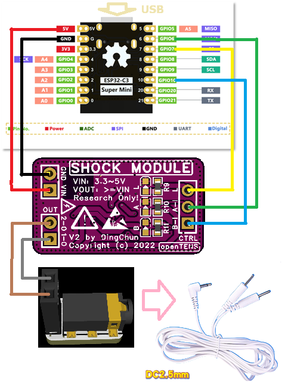

# 尝试openTENS电刺激模块基于ESP32C3的WebUI示例 - 教程

---

## 1. 硬件概述

We recommend **AC_TENS_version2** for a shock moudle and **adapterBoard_version1** to adapted your breadboard.

You can just download PCB Gerber or check project files in easyEDA.

---

## AC_TENS 电刺激模块

### 📍 Pinout Overview（引脚定义）

| 引脚名称 | 类型         | 功能说明           | 连接     |
| -------- | ------------ | ------------------ | -------- |
| VCC_3V3  | 电源         | 系统供电输入       | 3.3V~5V  |
| GND      | 地           | 公共地线           | 0V       |
| BOOST_L  | Boost Enable | 电刺激升压控制引脚 | PWM      |
| CTRL_B-I | Input        | 交流电刺激脉冲控制 | GPIO     |
| CTRL_A-I | Input        | 交流电刺激脉冲控制 | GPIO     |
| 1-O      | Output       | 交流电脉冲输出     | 理疗电极 |
| 2-O      | Output       | 交流电脉冲输出     | 理疗电极 |

<p align="center">
  
</p>

<p align="center">
  <em>图：openTENS AC_TENS_version2</em>
</p>

---

## adapterBoard 2.54mm针脚to2.5mm耳机孔转接板

### 📍 Pinout Overview（引脚定义）

| 引脚名称 | 类型        | 功能说明                       |
| -------- | ----------- | ------------------------------ |
| 2.54mm   | 2.54排针脚  | 可连接排针，面包板，电刺激模块 |
| 2.5mm    | 2.5mm耳机孔 | 可连接标准理疗仪电极线         |

<p align="center">
  
</p>

<p align="center">
  <em>图：openTENS adapterBoard_version1</em>
</p>

---

### 连线图

按照图中连线

1. 电源线：+5V, GND (0V)
2. 信号线：可编程输出引脚GPIO6,GPIO10连接电刺激模块脉冲控制脚，PWM输出引脚GPIO7连接电刺激模块升压控制脚
3. 脉冲输出线：电刺激模块OUT连接转接板后到DC2.5mm接口，最后连接电极片

<p align="center">
  
</p>


<p align="center">
  <em>图：c3demo_wire-pin</em>
</p>


## 2. 软件概述

---

## 🚀 Quick Start （在esp32c3上尝试webUI demo代码）

1. 电脑通过USB连接esp32，打开platformIO工程文件，下载webui代码
2. 下载成功后手机wifi连接esp32的热点，（注意，先关闭蜂窝数据网络），浏览器访问网址192.168.4.1
3. 看到如下界面说明成功访问webUI
<p align="center">  </p>

4. 调整各项参数，最后点击输出按钮启动脉冲输出

5. 参数说明：

   参数关系：强度参数决定了输出强度，其他参数决定触觉感受。多个脉冲输出合成一个感觉（一个感觉包含多次周期性脉冲）

   | 参数           | 效果                                                         | 单位 |
   | -------------- | ------------------------------------------------------------ | ---- |
   | 感觉强度       | （0时无感觉）调节感觉强弱                                    | 级   |
   | 输出脉冲脉宽   | （必须大于0）感觉越小感觉越轻抚，越大越刺痛，推荐设置70用于测试 | %    |
   | 输出脉冲周期   | （必须大于0）越小感觉越用力，越大越无力                      | 毫秒 |
   | 感觉的脉冲个数 | （至少为1）本次感觉里有几个脉冲                              | 个   |
   | 感觉的脉冲周期 | （可以为0）本次感觉结束后的间隔休息时间                      | 毫秒 |

   

   

---

### 电刺激库开发教程（Dev Library for Arduino / ESP32 / Keilu5_c）

openTENS 提供 通用的电刺激开发库，可移植到任何 ArduinoAVR / ESP8266 / ESP32 项目中，仅需 2 个文件（.c / .h） 即可实现电刺激功能。

---

### 📂 文件结构（你的项目中需要包含这两个文件）
```
/WIFIAP2SHOCK_ESP32-C3_PIO
 ├─ include/
 │   ├─ shockModule.h     ← ⭐ 主要头文件
 │   └─ main.h
 ├─ src/
 │   ├─ main.cpp
 │   └─ shockModule.c     ← ⭐ 实现文件
 ├─ platformio.ini
```


只需 shockModule.h + shockModule.c → 你的项目就能直接调用刺激模块。

---

### ⚡ 使用流程：4 步生成电刺激
Step	功能	所需代码
1	定义控制引脚	#define NET_P_Pin 10
2	初始化模块	shockAllInit(&shockPluse_s);
3	设置参数	shockPluseSenseSet(&shockPluse_s, slider_temp);
4	产生脉冲	shockPulseSenseUnit(&shockPluse_s);

#### 🧠 Step 1：定义刺激控制引脚

example：

```
#define NET_P_Pin      10	// 第一个交流脉冲控制脚，任意一个GPIO
#define NET_N_Pin      6	// 第二个交流脉冲控制脚，任意一个GPIO
#define BOOST_L_Pin    7	// 升压控制脚，必须支持pwm的引脚！
```


#### ⚙ Step 2：初始化模块

在全局申明一个新建电刺激对象结构体

```
shockPluse_t shockPluse_s;
```

在 setup() 函数里初始化电刺激功能，一个对象只需要初始化一次

```
shockAllInit(&shockPluse_s);
```

函数里初始化电刺激功能


#### 🧾 Step 3：设置刺激参数（可来自 Web UI）

Web UI 示例：
可直接通过滑块调整参数，手动测试好想要的脉冲参数后，即可写入结构体：

<p align="center">  </p>

对应代码设置（示例）：

```
int settings_temp[5] = {5, 70, 40, 7, 500};
// 0rder:{Level,Width us, Trig Period ms, Count, Sense Period ms}
```

把settings_temp设定参数传入电刺激对象

```
shockPluseSenseSet(&shockPluse_s, settings_temp);
```

p.s. 可以参考一下结构体内部设置（在 shockModule.c 中）：

```
void shockPluseSenseSet(shockPluse_t* shockPluse_s_p, int* p_temp){
    shockPluse_s_p->boost_Level = p_temp[0];  // 强度
    shockPluse_s_p->trig_Width = p_temp[1];   // 脉宽 %
    shockPluse_s_p->trig_T = p_temp[2];       // 脉冲周期 ms
    shockPluse_s_p->trig_Count = p_temp[3];   // 单次刺激个数
    shockPluse_s_p->usense_T = p_temp[4];     // 感觉周期
}
```


#### ⚡ Step 4：产生刺激脉冲
```
shockPulseSenseUnit(&shockPluse_s);
```

只需调用一次，即可输出一次完整刺激。（注意，次函数为**阻塞性延迟函数**）

---

### 🎯 代码函数使用逻辑图
**Set pins 设置连接引脚  →  Init module 初始化模块功能  →  Set parameters 设置电刺激参数  →  Run shockPulseSenseUnit() 运行脉冲输出**


---

##  脉冲参数的C语言数据结构

### `shockPluse_t`

Defines all runtime parameters for one stimulation cycle.

| Field                       | Type                 | Description                              |
| --------------------------- | -------------------- | ---------------------------------------- |
| `htim_Boost_L`              | `TIM_HandleTypeDef*` | Timer handle for PWM generation          |
| `Channel_Boost_L`           | `uint32_t`           | PWM channel                              |
| `GPIOx_Net_P / GPIOx_Net_N` | `GPIO_TypeDef*`      | H-Bridge output pins                     |
| `boost_T`                   | `uint32_t`           | Boost pulse duration (μs)                |
| `boost_F`                   | `uint32_t`           | Boost frequency (Hz)                     |
| `boost_Width`               | `float`              | PWM duty ratio (%)                       |
| `boost_Level`               | `uint8_t`            | Intensity level (0–15)                   |
| `trig_Width`                | `uint32_t`           | Trigger pulse width (μs)                 |
| `trig_T`                    | `float`              | Trigger period (ms)                      |
| `trig_Count`                | `uint16_t`           | Number of trigger pulses per stimulation |
| `usense_T`                  | `float`              | Delay between stimulations (ms)          |

---